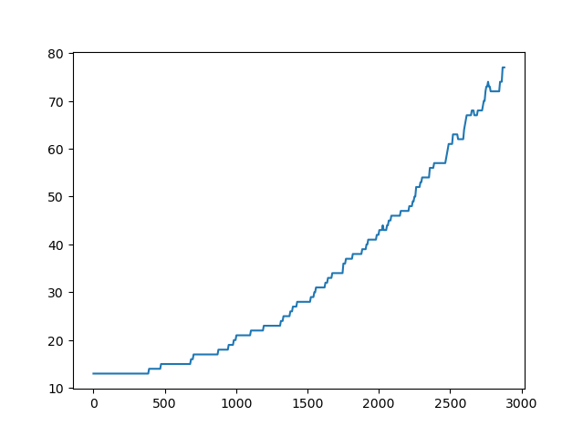

# project-cellcycle : Project on personalization of cell cycle model on GDSC cell lines data

Students will use cell line omics data to personalise a cell cycle model published by Sizek et al. 2019. and study the effects of drugs on the control of the cell cycle. First, students will use MaBoSS to study the effects on the intracellular signalling model, and find interesting single or double mutants. Then, they will use this model in a PhysiBoSS simulation to study the effect of these mutants in a population of cells.

Sizek model is available in the models directory, together with a dictionnary to map the model's node with the gene identifier.

### Installing dependencies

To be able to use the following scripts, you need to install a few packages first using conda. For this, we provide an conda environment file : environment.yml. 
To install it, run : 

```
micromamba env create -f environment.yml
```

Once installed, you'll need to activate it using : 

```
micromamba activate project-cellcycle
```

### Installing data files

The data folder is provided compressed, and needs to be uncompressed using: 

```
unzip data.zip
```

### Personalizing MaBoSS models

To personalize MaBoSS model, we provide a script called personalize_celllines.py

```
python personalize_celllines.py [-h] -r RNASEQ -m MUTATIONS [-l CELL_LINES] -b BND_FILE -c CFG_FILE -d DICTIONNARY
```

It uses a beta version of profile for python, developed by Saran Pankaew.
We are providing the RNASEQ and MUTATIONS data in the data/CL folder. For RNA seq, the preprocessed file has to be used. 


### Configuring a PhysiBoSS model

To change the MaBoSS model of a PhysiBoSS model, change the output directory, or add mutants, we provide a script called physicell_config.py

```
python physicell_config.py [-h] -b BND_FILE -c CFG_FILE [-m MUTATION MUTATION] -o PHYSICELL_OUTPUT_FOLDER -p PHYSICELL_FILE
```

Mutations must be in the format : \<Node\> <OFF|ON>

### Compiling PhysiCell

We provide a ready to use PhysiBoSS model using Sizek model to control the PhysiCell cell cycle, available in the PhysiCell folder. 
Before starting simulation, we need to compile it using :  

```
cd PhysiCell
make
```

This will produce an executable called project.

### Running a simulation

PhysiCell uses XML config files to setup a simulation. These config files (as well as the one you created using the physicell_config.py script) are stored in the PhysiCell/config. 
To run a simulation, run : 

```
cd PhysiCell
./project config/PhysiCell_settings.xml
```

This will produce simulation results stored by default in the PhysiCell/output folder, or in the output folder you informed in the script physicell_config.py. 

### Analyse the result of a simulation

A very simple analysis you can do on the results of the simulation is to plot the growth curve of the population of cell. We provide an example to do this using : 

```
python growthcurves.py -f <output_folder>
```

This will produce an image similar to this, showing the time evolution of the cell population size : 

